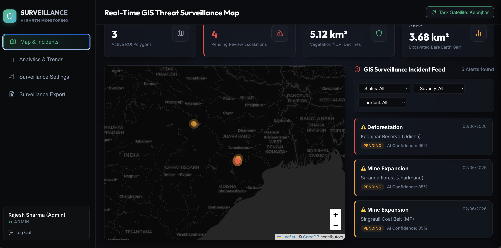
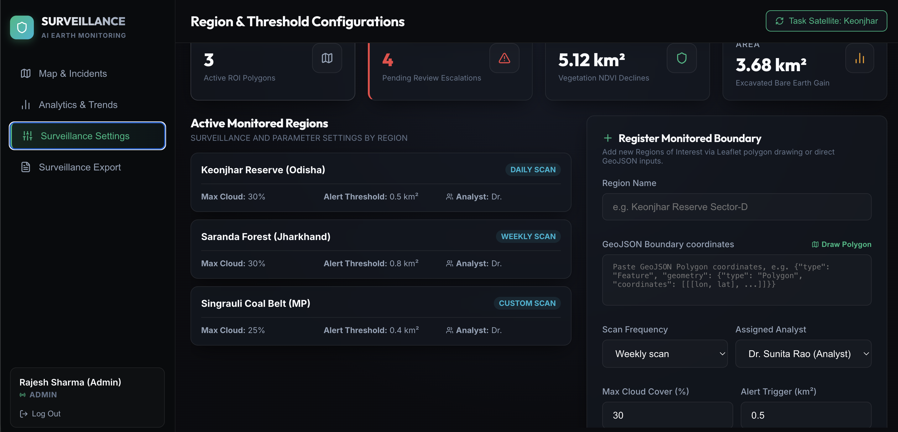
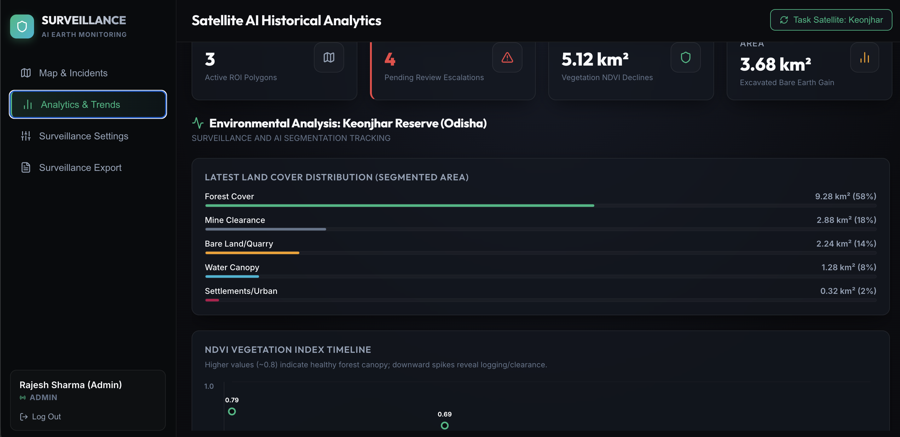

# Illegal Mining & Deforestation Detection System

An automated system designed to monitor and detect unauthorized mining activities and forest cover loss using simulated satellite imagery and AI analysis.

---

## Table of Contents
1. [About the Project](#about-the-project)
2. [Key Features](#key-features)
3. [System Architecture](#system-architecture)
4. [Technologies Used](#technologies-used)
5. [Getting Started](#getting-started)
6. [Usage Guide](#usage-guide)
7. [Future Scope](#future-scope)

---


## Demo/Screenshots





## About the Project

### The Problem
Illegal mining and uncontrolled deforestation cause severe environmental damage. Monitoring these activities over vast areas of land using physical patrols is slow, expensive, and often dangerous.

### The Solution
This project provides a software solution to automate environmental monitoring. It acts as a centralized dashboard for forest departments and environmental agencies. By analyzing satellite images of specific regions, the system can automatically flag areas where suspicious land changes have occurred, allowing authorities to act quickly.

*Note: This MVP uses a simulated backend to generate realistic image data and analysis results for demonstration purposes.*

---

## Key Features

- **Automated Monitoring:** Continuously tracks defined Regions of Interest (ROIs) for environmental changes.
- **Visual Dashboard:** An interactive map interface to view monitored areas, active alerts, and historical trends.
- **Alert System:** Automatically generates alerts when deforestation or mining activity crosses a certain threshold. Alerts are categorized by severity.
- **Image Comparison:** Provides visual "before and after" comparisons of satellite images to verify AI findings.
- **User Roles:** Secure access control with different roles (Admin, Analyst, Field Officer, Authority) to ensure that only authorized personnel can review or act on alerts.

---

## System Architecture

The project is divided into two main components:

1. **Frontend (User Interface):** A web application where users log in to view the map, manage regions, and review alerts. It communicates with the backend to fetch data.
2. **Backend (Server & Simulation):** The core engine that handles user accounts, stores data, and simulates the downloading and processing of satellite imagery. It calculates changes in land cover and generates alerts when necessary.

---

## Technologies Used

### Frontend
- **React.js & Vite:** For building a fast and responsive user interface.
- **Leaflet.js:** For displaying interactive maps and geographical data.
- **CSS:** Standard CSS used to create a clean, modern, and dark-themed design.

### Backend
- **Python & FastAPI:** For building the server and handling API requests quickly.
- **SQLite & SQLAlchemy:** A lightweight database setup to store user data, alerts, and region information without complex configuration.
- **Pillow (PIL):** Used to generate and manipulate simulated satellite images.
- **JWT (JSON Web Tokens):** For secure user authentication.

---

## Getting Started

Follow these steps to set up the project on your local machine.

### Prerequisites
- Python 3.8 or higher
- Node.js (v14 or higher) and npm

### 1. Setup the Backend

Open a terminal in the root directory of the project and run the following commands:

```bash
# Navigate to the project root (if not already there)
cd "Illegal Mining & Deforestation Detection"

# Create a virtual environment
python3 -m venv backend/venv

# Activate the virtual environment (Mac/Linux)
source backend/venv/bin/activate
# (For Windows use: backend\venv\Scripts\activate)

# Install required Python packages
pip install -r backend/requirements.txt

# Seed the database with initial test data
PYTHONPATH=. python3 backend/seed.py

# Start the backend server
uvicorn backend.main:app --reload --port 8000
```
The backend API is now running. You can view the API documentation at `http://127.0.0.1:8000/docs`.

### 2. Setup the Frontend

Open a **new terminal window**, navigate to the project root, and run:

```bash
# Navigate to the frontend folder
cd frontend

# Install Node dependencies
npm install

# Start the frontend application
npm run dev
```
The frontend is now running. Open your web browser and go to `http://localhost:5173`.

---

## Usage Guide

Once both servers are running, you can access the dashboard.

### Demo Credentials
Use any of the following accounts to log in:
- **Admin:** Username: `admin` | Password: `admin123`
- **Analyst:** Username: `analyst` | Password: `admin123`
- **Field Officer:** Username: `field_officer` | Password: `admin123`

### Navigating the System
1. **Map View:** The main screen displays a map with your defined Regions of Interest (highlighted polygons).
2. **Alerts:** Check the right-side panel for active alerts. Click on an alert to see the details, including coordinates and a visual comparison of the affected area.
3. **Actions:** If logged in as an Analyst or Admin, you can "Confirm" or "Dismiss" alerts based on the visual evidence.

---

## Future Scope

While this version is a functional MVP with simulated data, future updates could include:
- Integration with real satellite APIs (e.g., Sentinel Hub, Google Earth Engine).
- Implementation of actual machine learning models (like U-Net) for live image segmentation.
- Mobile application support for field officers.
- Automated report generation and email notifications to local authorities.
